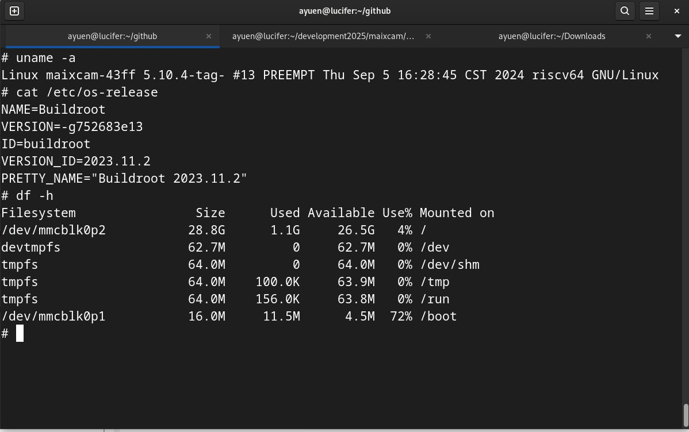

# MaixCAM-NPU - Using MaixCAM's Neural Processing Unit (NPU) to run inference on your custom YOLOv5 model

Here is the associated Youtube video:
 

## 1. Introducing MaixCAM

MaixCAM from Sipeed is an AI camera for the rapid development/deployment of AI vision, audio, and AIOT applications.There are several similar AI cameras from China based on RISC-V processors with a NPU. This is the first one that I picked up from AliExpress and it works. I've tried converting my YOLOv5 models to run on NPUs of a number of ARM-based Single board computers (SBCs) without success due to insufficient memory for the NPUs and more times than not, lack of documentation and examples. This is the first time I find success running my model on a NPU.

For those who are not familiar with NPUs or Neural Processing Units, a NPU is a specialized hardware accelerator designed to accelerate artificial intelligence (AI) and machine learning (ML) tasks, particularly those involving neural networks, by efficiently handling parallel, data-driven computations. NPUs are more power efficient then GPUs. They are good at inference. For model training, GPUs are still indispensible.

Here is a partial hardware specifications of the MaixCAM:

The MaixCAM uses SOPHGO's SG2002 chip. It is interesting to note that the hardware consists of 2 RISC-V CPUs: the big one for running Linux and the little one for running Real-Time Operating System (RTOS). It also has an ARM A53 processor but one can either use the RISC-V processors or the ARM processor but not at the same time. It also has a 1 TOPS (Tera Operations per Second) NPU. It is the NPU which enables running inference on the MaixCAM as the RISC-V processors will struggle to run the same task.

## 2. Repository Directory Structure 
The repo directory structure is shown below:
<pre>
tree -L 1 maixcam-npu
maixcam-npu
├── deployment
├── images
├── LICENSE
├── README.md
├── test-images
└── test-videos
</pre>
* deployment - contains the files needed to convert the YOLOv5 model for the MaixCAM NPU and the application code
* images - contains the images used in the README.md file
* test-images - contains images of the robots required by the <i>run_calibration</i> quantization tool
* test-videos -  contains the video used in testing the MaixCAM inference application.

##  3. Converting Your YOLOv5 Model to Run on the NPU
I am going to use a custom YOLOv5 model trained using transfer learning to identify a blue and a red robot for this conversion exercise.

### 3.1 The Approach
The approach to convert your YOLOv5 model to run on the NPU is similar to many NPUs found on SBCs or using OpenVINO with INTEL CPUs to make use of the iGPUs. It usually consists of the following steps:
1. convert your YOLOv5 model to the ONNX (Open Neural Network Exchange) format
2. use vendor-provided tools to transform the ONNX model to the proprietary format of the NPU
3. use vendor-provided tools to perform quantization on the transformed model. AI quantization is a technique that reduces the computational and memory demands of machine learning models by representing their parameters (weights and activations) with lower-precision data types like 8-bit integers instead of the usual 32-bit floating points.
4. deploy and run the qantized converted NPU model on the target hardware

### 3.2 Sipeed Maix Tools
Instead of installing various vendor-provided tools, it is much more convenient to create a container with those tools. Lucikily, someone @HardwareAI has already created the Dokerfile. All you need to do is run the following commands to create a container image with the tools required:
<pre>
git clone https://github.com/AIWintermuteAI/maixcam-model-conversion
cd maixcam-model-conversion
podman build -t maixcam-model-conversion .
podman images
</pre>
And you will see the follow images:
<pre>
REPOSITORY                          TAG         IMAGE ID      CREATED        SIZE
localhost/maixcam-model-conversion  latest      af26a5321c53  5 minutes ago  8.86 GB
docker.io/sophgo/tpuc_dev           v3.2        191a433358ad  9 months ago   7.88 GB
</pre>
I am using podman but you can use docker instead.

### 3.3 Converting Your YOLOv5 Model
You have to convert your YOLOv5 model to the ONNX format first. Assuming you have a YOLOv5 Python virtual environment, activate the virtual environment and change to  YOLOv5's top directory as the export.py script is in there.
<pre>
source >i>/path/yolovEnvironment</i>/bin/activate
cd YOLOv5
python export.py --weights /path/robots.pt --include onnx --img 224 320
</pre>
Sipeed documentation, recommends changing the image size to 320X224 to make the MaixCAM more efficient because 320X224 is close to the MaixCAM screen resolution.

#### 3.3.1 Start the container
<pre>
podman run -it --rm --name maixcam localhost/maixcam-model-conversion:latest /bin/bash
mkdir -p /app/model
</pre>

#### 3.3.2 Copy the robots.onnx and test-images to the container

<pre>
podman cp <i>path</i>/deployment/robots.onnx containerID:/app/model/
# copy test-images directory to container
podman cp <i>path</i>/deployment/test-images containerID:/app/
</pre>
The containerID can be obtained by the command:
<pre>
podman ps --filter name=maixcam --format "{{.ID}}"
</pre>

#### 3.3.3 Get the Names of the Last Convultions in the Model
Go to [netron](https://netron.app/) and Open the model (robots.onnx) in Netron, page down to the bottom and record the names of the last convolutions (4 in total) in the model as in:

Add the names to the model_transform command and run these commands inside the container:
<pre>
cd /app/model
model_transform \
--model_name robots \
--model_def robots.onnx \
--input_shapes [[1,3,224,320]] \
--mean 0.0,0.0,0.0 \
--scale 0.0039216,0.0039216,0.0039216 \
--keep_aspect_ratio \
--pixel_format rgb \
--output_names "/model.33/m.0/Conv_output_0","/model.33/m.1/Conv_output_0","/model.33/m.2/Conv_output_0","/model.33/m.3/Conv_output_0" \
--mlir robots.mlir
</pre>

#### 3.3.4 Perform Quntization on the Converted Model
Following the presious step, run the following commands in the container:
<pre>
run_calibration robots.mlir \
--dataset /app/images \
--input_num 100 \
-o robots_cali_table

model_deploy \
--mlir robots.mlir \
--quantize INT8 \
--calibration_table robots_cali_table \
--processor cv181x \
--model robots_cv181x_int8_sym.cvimodel
</pre>

The /app/model directory in the container will have the following content:

<pre>
root@0d80808a2815:/app/model# ls
_weight_map.csv         robots_cv181x_int8_sym.cvimodel         robots_top_f32_all_origin_weight.npz
final_opt.onnx          robots_cv181x_int8_sym_final.mlir       robots_top_f32_all_weight.npz
robots.mlir             robots_cv181x_int8_sym_tensor_info.txt  robots_tpu_addressed_cv181x_int8_sym_weight.npz
robots.onnx             robots_cv181x_int8_sym_tpu.mlir         robots_tpu_addressed_cv181x_int8_sym_weight_fix.npz
robots_cali_table       robots_opt.onnx.prototxt
robots_cv181x_int8_sym  robots_origin.mlir
</pre>

#### 3.3.5 Copying the Generated Files to Your Computer
Since we are not using any volumes in the container for persistence, once you exit the container, all its content will be gone. Make sure you save the converted model before you exit.

<pre>
podman cp containerID:/app/model /<i>path</i>/
</pre>
  Here are the files in the model folder:
<pre>
tree model
model
├── final_opt.onnx
├── robots_cali_table
├── robots_cv181x_int8_sym
│   └── final.mlir
├── robots_cv181x_int8_sym.cvimodel
├── robots_cv181x_int8_sym_final.mlir
├── robots_cv181x_int8_sym_tensor_info.txt
├── robots_cv181x_int8_sym_tpu.mlir
├── robots.mlir
├── robots.onnx
├── robots_opt.onnx.prototxt
├── robots_origin.mlir
├── robots_top_f32_all_origin_weight.npz
├── robots_top_f32_all_weight.npz
├── robots_tpu_addressed_cv181x_int8_sym_weight_fix.npz
├── robots_tpu_addressed_cv181x_int8_sym_weight.npz
└── _weight_map.csv

2 directories, 16 files

</pre>

## 4. Deploying and Running Your YOLOv5 model on MaixCAM
### 4.1 Prerequsites
1. if your MaixCAM shows a system version older than mine (see screen capture), you have to updgrade its firmware to at lease my version because the older version does not work. Consult the [wiki ](https://wiki.sipeed.com/maixpy/doc/en/basic/upgrade.html) on how to upgrade. I did not try newer versions as Sipeed recommends staying at a version that works for you. Newer versions may introduce subtle differences that render certain apps to run erroneously. 

2. Install the [MaixVision](https://wiki.sipeed.com/maixvision) IDE.
3. Set up your MaixCAM with a local IP address

### 4.2 Testing your Application on MaixVision IDE
Information on MaixVision can be found [here](https://wiki.sipeed.com/maixpy/doc/en/index.html#Preparing-the-Development-Environment).
 
The MaixVision IDE user interface is shown below:

you only need 3 files to run your converted model: 
* main.py - the inference application written in MaixPy
* robots_cv181x_int8_sym.cvimodel - the .cvimodel file is the converted model for MaxiCAM
* robots.mud - mud stands for Model Universal Description file. It specifies the file name and path to the .cvimodel together with other metadata

To run the model (watch my Youtube video):
1. Start the MaixVision IDE, open the deployment folder and select the main.py script
2. Plug in the USB cable connecting the MaixCAM to your computer or to a 5V power source to provide the MaixCAM with power
3. Connect the MaixVision IDE to your MaixCAM using the Connect icon, the top one in the bottom left column of icons
4. Open the Device File Manager. Make sure you are in the "/ > root > models" folder. Click on the Upload Files button and select the files: robots_cv181x_int8_sym.cvimodel and robots.mud in the deployment folder to upload
5. Click on either the Run File or Run Project icon, the icons below the Connect icon
6. Point your MaixCAM to a running video of the 2 robots as I did in the Youtube video. The image on the top right-hand corner of the IDE mirrors the screen of your MaixCAM.
7. When done, click on the Stop button
8. Disconnect the MaixCAM

Note: You may have to close the Device File Manager to see the captured image at the top right-hand corner.

  Please note that the application we ran was not permanently installed on the MaixCAM.

 

### 4.3 Deploying the Model to MaixCAM
You have to create an application package and install it on MaixCAM using the MaixVsion IDE. To create a package, whether your application consists of a single or multiple Python scripts, there must be a main.py script which starts your application.
Please refer to my Youtube video on how to do it using the MaixVision IDE.
  After creating and installing the package, your 'deployment' folder will contain some additional files:
<pre>
tree deployment
deployment
├── app.yaml
├── dist
│   └── maix-rbrobot-v1.0.0.zip
├── main.py
├── robots_cv181x_int8_sym.cvimodel
├── robots.mud
├── robots.onnx
└── robots.pt

2 directories, 7 files
</pre>
The new files include:
* app.yaml -  contains the information you entered while creating the package
* maix-rbrobot-v1.0.0.zip - the package that can be uploaded to the  MaixHub for sharing or installed on other MaixCAMs that you may have.

## 5. Inference Performance Comparison
Running main.py on MaixCAM can identify the B-Robot/R-Robot on the screen as well as displaying the frame rate and execution time for running the inference using nn.YOLOv5's detect method in milliseconds. The average execution time is around 72 milliseconds. Reasonable for such a small, inexpensive device.
 I ran the same model on a Nvidia AGX Xavier computer with 8 CPUs and 512 Cuda cores which achieves an average execution time of 28 millisonds or 2.6 times faster but the AGX is over 18 times more expensive than the MaixCAM. And the AGX does not come with a camera.

## 6. Accessing MaixCAM's Linux System
Once you configured the WIFI on the MaixCAM, you can ssh into its Linux system.
<pre>
ssh root@<i>MaixCAM-IP</i>
</pre>
The password is: root
Here are some screenshots. You can explore on your own.

This is the system resource usage when MaixCAM is idle ie, not running any inference.

When running main.py, the system resource usage shoots up.

It looks like inference is performed in the MaixCAM's Linux system. In other words, running on the big RISC-V core. I suspect that the little core is not used at all when running MaixPy.

## 7. Conclusion
The MaixCAM is small, light-weight and power efficient in comparison to an AI computer. If you need to run model inference and its performance is adequate for your application, the MaixCAM is a much cheaper and greener solution for the Edge than computers built for AI.
 It also gives you a choice of using Python, C/C++ or a combination of both.
 If interested, you may also explore the [MaixHub](https://maixhub.com/app) to find applications that you can download and run.

